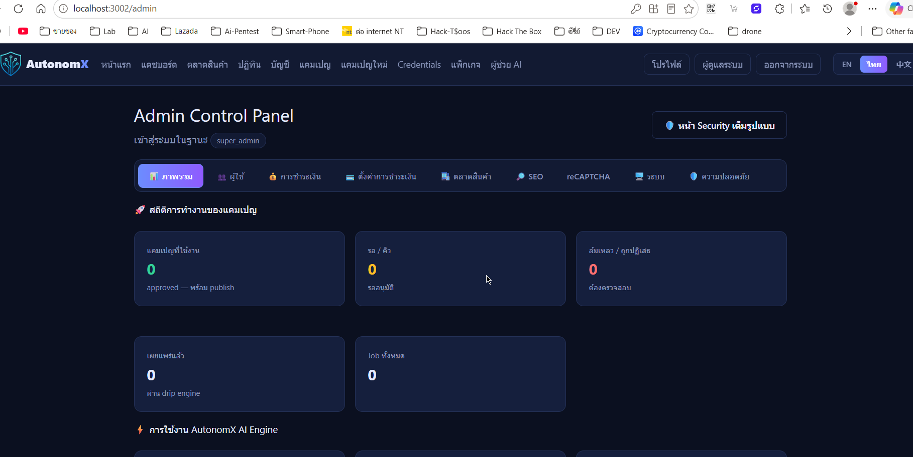

  

<h1 align="center">🛡️ VektorSec — AI Penetration Testing Agent</h1>

  An open-source AI agent designed for <b>penetration testing / CTF / boot2root</b> —
  connects to your Kali attack box, executes tools, analyzes output, and autonomously loops until the objective is met. 
  Simply define the target — the agent handles the rest.

  
  
  

> ⚠️ **Disclaimer**: VektorSec is strictly intended for **authorized security testing only**.
> Explicit permission from the target system owner is required prior to testing. Users assume all responsibility and legal liability for their actions.

---

## 📑 Table of Contents

- [What is VektorSec?](#-what-is-vektorsec)
- [Key Features](#-key-features)
- [Architecture](#-architecture)
- [System Requirements](#-system-requirements)
- [Project Structure](#-project-structure)
- [Configuration Files](#-configuration-files)
- [Quick Start (Docker)](#-quick-start-docker)
- [Production Deployment with Docker + Nginx + SSL](#-production-deployment-with-docker--nginx--ssl)
- [Automated Deployment via Script / Caddy](#-automated-deployment-via-script--caddy)
- [Updates and Backups](#-updates-and-backups)
- [Security Checklist](#-security-checklist)
- [Developer Mode](#-developer-mode)
- [Documentation](#-documentation)
- [Credits and License](#-credits-and-license)

---

## 🧠 What is VektorSec?

VektorSec is an agentic AI penetration-testing system. It executes real commands on an attack box (via SSH/Kali or an integrated Kali container), reads the output, analyzes results, and decides the next step autonomously without constant human intervention — ideal for real-world pentesting, boot2root challenges, and CTFs.

Real-world execution example: Agent performing an authentication bypass on [OWASP Juice Shop](https://owasp.org/www-project-juice-shop/).

  

  

## ✨ Key Features

- **Agentic execution** — Executes commands on the attack box, parses output, and loops continuously up to 25 iterations/turns.
- **16 agent tools** — Bash execution, Python scripts, tool installation, shell management, Google search, subagent spawning, Burp Suite (Proxy history/Repeater/Intruder/Collaborator), and browser automation.
- **100+ capabilities** — Registry of tools/packages for network, rev, pwn, crypto, forensics, stego, and core pentesting workflows.
- **Burp Suite integration** — Inspect proxy history, push requests to Repeater/Intruder, and utilize Collaborator for Out-of-Band (OOB) testing.
- **Browser agent (Magnitude)** — Real browser automation with visual live-streaming via VNC in Docker mode.
- **VPN management** — Upload `.ovpn` profiles and manage multi-tunnel connect/disconnect states via the web interface.
- **Subagent parallelism** — Run background sub-tasks concurrently (e.g., directory brute-forcing alongside subdomain enumeration).
- **Safety checks** — High-risk commands (destructive file deletion, block device writes, fork bombs) require explicit user approval.
- **Bring Your Own Model (BYOM)** — Supports OpenAI, Anthropic (API key or OAuth), Google, Mistral, or any OpenAI-compatible endpoint; works with locally authenticated Codex CLI / Claude Code.
- **MCP access** — Exposes a Model Context Protocol (MCP) control plane for integration with Claude Code / Codex.

---

## 🏗️ Architecture
