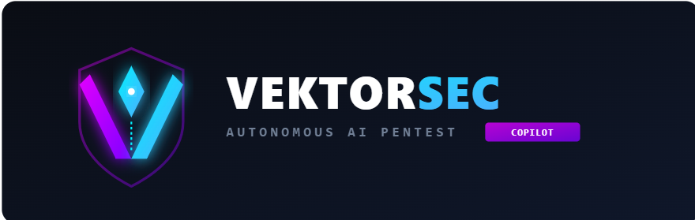
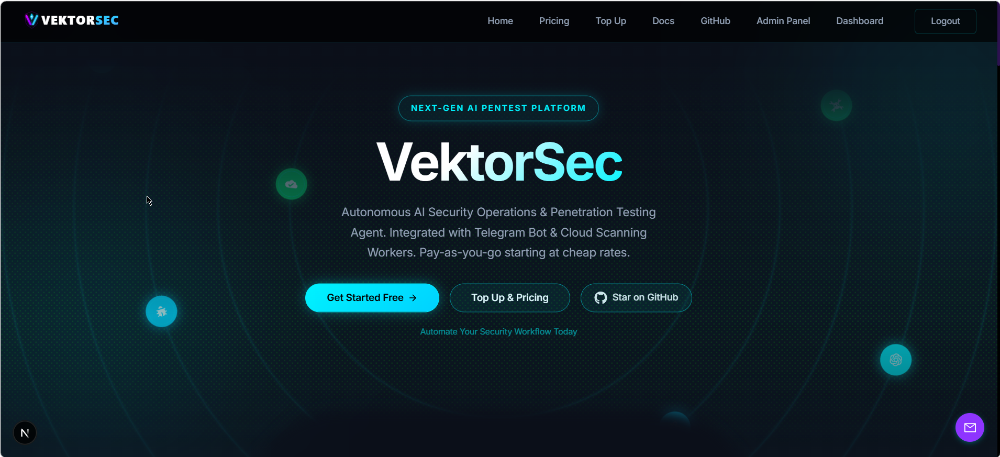
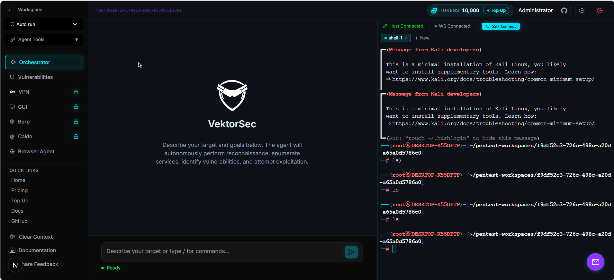

  

<h1 align="center">🛡️ VektorSec — AI Penetration Testing Agent</h1>

  <b>English</b> · <a href="./README.th.md">ไทย</a>

 

<!-- Modern Security Alert Card for Markdown -->

  

    

      <svg xmlns="http://www.w3.org/2000/svg" fill="none" viewBox="0 0 24 24" stroke-width="1.8" stroke="#ef4444" style="width: 28px; height: 28px;">
        <path stroke-linecap="round" stroke-linejoin="round" d="M16.5 10.5V6.75a4.5 4.5 0 10-9 0v3.75m-.75 11.25h10.5a2.25 2.25 0 002.25-2.25v-6.75a2.25 2.25 0 00-2.25-2.25H6.75a2.25 2.25 0 00-2.25 2.25v6.75a2.25 2.25 0 002.25 2.25z" />
      </svg>
    

    <h3 style="color: #ffffff; font-size: 1.2rem; font-weight: 600; margin: 0 0 10px 0; border: none; padding: 0;">Access Restricted</h3>
    

      The <strong style="color: #f1f5f9;">PentestDB</strong> team has enabled a security system (<strong style="color: #f1f5f9;">Scope Guard</strong>) to prevent misuse.
    

    <a href="https://facebook.com" target="_blank" rel="noopener noreferrer" style="display: inline-flex; align-items: center; justify-content: center; gap: 8px; background-color: #1877f2; color: #ffffff; font-weight: 600; font-size: 0.9rem; padding: 10px 20px; border-radius: 8px; text-decoration: none; transition: background-color 0.2s;">
      <svg xmlns="http://www.w3.org/2000/svg" viewBox="0 0 24 24" fill="#ffffff" style="width: 18px; height: 18px; display: inline-block; vertical-align: middle;">
        <path d="M24 12.073c0-6.627-5.373-12-12-12s-12 5.373-12 12c0 5.99 4.388 10.954 10.125 11.854v-8.385H7.078v-3.47h3.047V9.43c0-3.007 1.792-4.669 4.533-4.669 1.312 0 2.686.235 2.686.235v2.953H15.83c-1.491 0-1.956.925-1.956 1.874v2.25h3.328l-.532 3.47h-2.796v8.385C19.612 23.027 24 18.062 24 12.073z"/>
      </svg>
      Contact via Facebook to Unlock
    </a>
  

 

  Open-source AI agent for <b>penetration testing / CTF / boot2root</b> —
  it connects to your Kali attack box, runs the tools, analyses the output and
  keeps looping on its own until the job is done. 
  You name the target, the agent handles the rest.

  
  
  

  <b>PentestDB</b> @ Developer By <b>Raysiya</b> ·
  <a href="https://github.com/PentestDB/vektorsec-community">github.com/PentestDB/vektorsec-community</a>

> ⚠️ **Disclaimer**: VektorSec is intended for **authorized security testing only**.
> Always obtain explicit permission from the system owner before testing. You are
> responsible for how you use it.

---

## 📑 Table of Contents

- [What is VektorSec](#-what-is-vektorsec)
- [Key Capabilities](#-key-capabilities)
- [Architecture](#-architecture)
- [Requirements](#-requirements)
- [Project Structure](#-project-structure)
- [Configuration Files](#-configuration-files)
- [Quick Start (Docker)](#-quick-start-docker)
- [Production Deploy with Docker + Nginx + SSL](#-production-deploy-with-docker--nginx--ssl)
- [Automated Deploy Scripts / Caddy](#-automated-deploy-scripts--caddy)
- [Updating and Backup](#-updating-and-backup)
- [Security Checklist](#-security-checklist)
- [Development (Developer mode)](#-development-developer-mode)
- [More Documentation](#-more-documentation)
- [Support & Donations](#-support--donations)
- [Credits and License](#-credits-and-license)

---

## 🧠 What is VektorSec

VektorSec is an agentic AI penetration-testing agent: it executes real commands on an
attack box (SSH/Kali, or the built-in Kali container), reads the output, analyses it and
decides the next step by itself — no hand-holding. It is built for real engagements,
boot2root boxes and CTFs.

Real-world example: the agent exploits an auth bypass in [OWASP Juice Shop](https://owasp.org/www-project-juice-shop/)

  

  

## ✨ Key Capabilities

- **Agentic execution** — the agent runs commands on the attack box, reads the results and keeps looping for up to 25 iterations per turn
- **60 agent tools** — bash, Python scripts, tool installation, shell management, Google search, subagents, Burp Suite (proxy history/Repeater/Intruder/Collaborator), Caido, Mythic C2, nmap/nuclei/ffuf/gobuster/naabu scans, browser automation and more
- **100+ capabilities** — a registry of tools/packages for network, rev, pwn, crypto, forensics, stego and core work
- **Burp Suite integration** — read proxy history, send requests to Repeater/Intruder, use Collaborator for OOB testing
- **Browser agent (Magnitude)** — real browser automation, streamed into the UI over VNC in Docker mode
- **VPN management** — upload `.ovpn` files and connect/disconnect from the web UI (multiple at once)
- **Subagent parallelism** — run sub-tasks concurrently, e.g. directory brute-force plus subdomain enumeration at the same time
- **Safety checks** — dangerous commands (recursive delete, writing to devices, fork bombs) always require approval first
- **Bring your own model** — OpenAI, Anthropic (API key or OAuth), Google, Mistral or any OpenAI-compatible endpoint; Codex CLI / Claude Code already logged in on the host also work
- **MCP access** — expose the control plane over MCP so Claude Code / Codex can drive it

---

## 🏗️ Architecture
