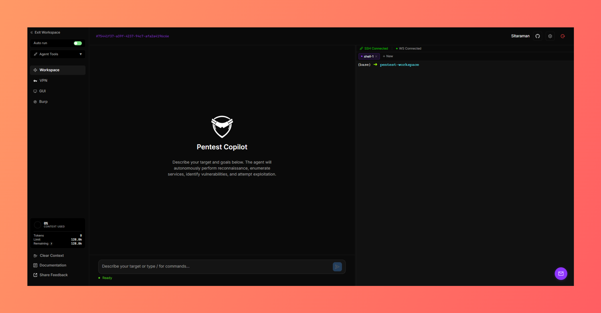
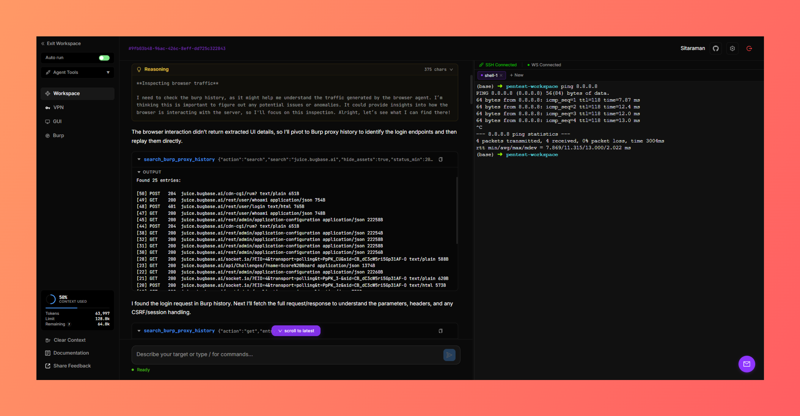

  

<h1 align="center">🛡️ VektorSec — AI Penetration Testing Agent</h1>

  <a href="./README.th.md">ไทย</a> · <b>English</b>

  ⚠️ The PentestDB team has enabled a security system (Scope Guard) to prevent misuse. To unlock, please contact (1) <a href="https://www.facebook.com/Pentestdb/" style="color: red; text-decoration: underline;">Facebook</a>

  An open-source AI agent for <b>penetration testing / CTF / boot2root</b> tasks —
  Connects directly to a Kali attack box, executes tools, analyzes results, and autonomously loops until the task is complete. 
  Just provide the target, and the agent handles the rest.

  
  
  

> ⚠️ **Disclaimer**: VektorSec is strictly intended for **authorized security testing only**.
> Explicit permission must be granted by the system owner prior to any testing. Users bear full responsibility for their own actions.

---

## 📑 Table of Contents

- [What is VektorSec?](#-what-is-vektorsec)
- [Key Features](#-key-features)
- [Architecture](#-architecture)
- [System Requirements](#-system-requirements)
- [Project Structure](#-project-structure)
- [Configuration Files](#-configuration-files)
- [Quick Start (Docker)](#-quick-start-docker)
- [Production Deployment with Docker + Nginx + SSL](#-production-deployment-with-docker--nginx--ssl)
- [Automated Deployment via Scripts / Caddy](#-automated-deployment-via-scripts--caddy)
- [Updates and Backups](#-updates-and-backups)
- [Security Checklist](#-security-checklist)
- [Development (Developer Mode)](#-development-developer-mode)
- [Additional Documentation](#-additional-documentation)
- [Credits and License](#-credits-and-license)

---

## 🧠 What is VektorSec?

VektorSec is an agentic AI penetration-testing agent: it runs real commands on an attack box (via SSH/Kali or an embedded Kali container), reads outputs, analyzes results, and decides the next steps autonomously without requiring human micro-management — ideal for real-world pentesting, boot2root boxes, and CTFs.

Real execution example: An agent performing an auth bypass in [OWASP Juice Shop](https://owasp.org/www-project-juice-shop/).

  

  

## ✨ Key Features

- **Agentic Execution** — The agent executes commands on the attack box, interprets the output, and iterates up to 25 loops per turn.
- **16 Agent Tools** — Bash, Python scripting, tool installation, shell management, Google search, subagent spawning, Burp Suite integration (proxy history/Repeater/Intruder/Collaborator), and browser automation.
- **100+ Capabilities** — Tool/package registry covering network, rev, pwn, crypto, forensics, stego, and core pentesting.
- **Burp Suite Integration** — Inspect proxy history, send requests to Repeater/Intruder, and use Collaborator for out-of-bounds (OOB) testing.
- **Browser Agent (Magnitude)** — Real browser automation with visual web page monitoring via VNC stream in Docker mode.
- **VPN Management** — Upload `.ovpn` files to connect or disconnect via the web UI (supports concurrent multiple VPN connections).
- **Subagent Parallelism** — Run concurrent sub-tasks simultaneously, such as directory brute-forcing alongside subdomain enumeration.
- **Safety Checks** — Dangerous commands (recursive deletion, raw device writes, fork bombs) require explicit user approval.
- **Bring Your Own Model** — OpenAI, Anthropic (API key or OAuth), Google, Mistral, or any OpenAI-compatible endpoint; supports local Codex CLI / Claude Code sessions.
- **MCP Access** — Exposes a control plane via Model Context Protocol (MCP) for Claude Code or Codex integration.

---

## 🏗️ Architecture
