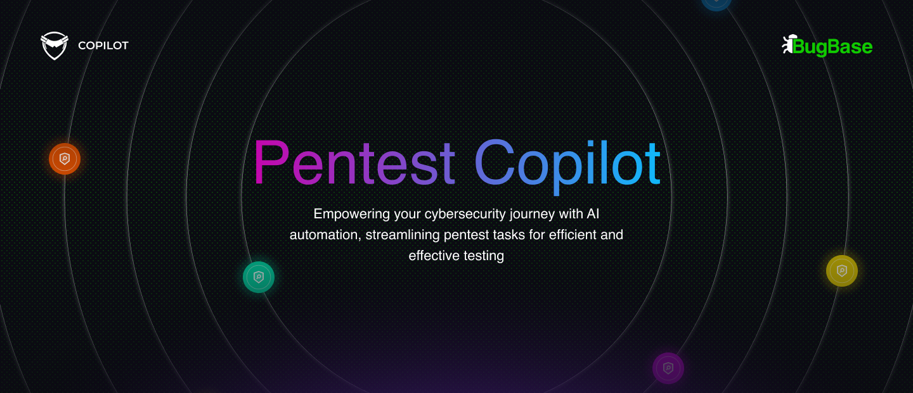
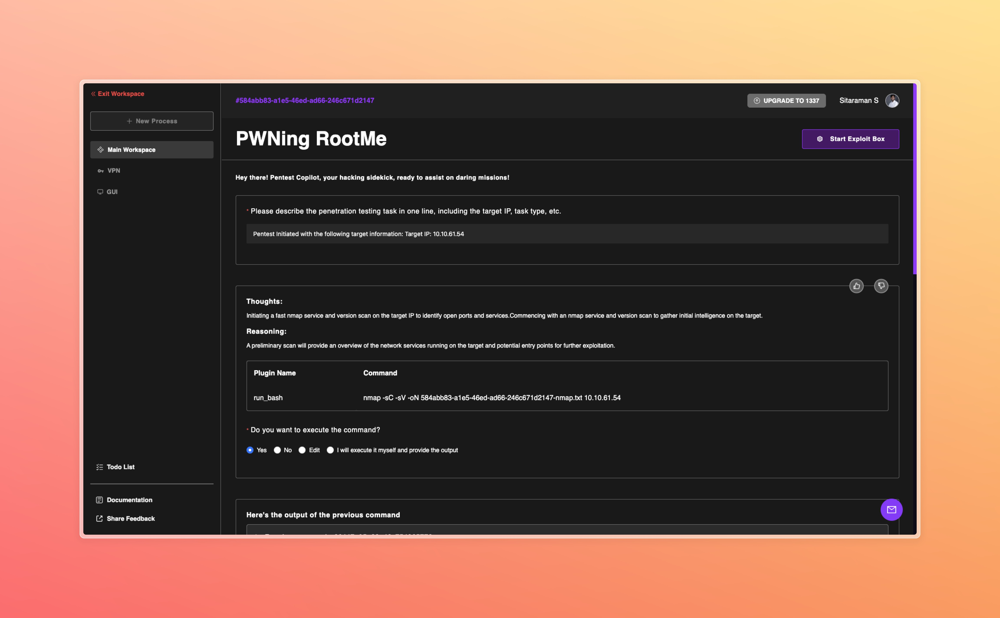

<p align="center">
  
</p>

# Pentest Copilot


Pentest Copilot is a state-of-the-art, open-source autonomous pentesting solution built for real-world engagements—with support for boot2root boxes and CTF challenges.

Explore the [Github Wiki](https://github.com/bugbasesecurity/pentest-copilot/wiki) for detailed documentation on features, installation, and usage.

---

<p align="center">

</p>

## Pentest Copilot in Action

A walkthrough of Pentest Copilot testing a TryHackMe machine [RootMe](https://tryhackme.com/room/rrootme).

https://github.com/user-attachments/assets/5e50b14b-a64f-4ba1-9449-52d5ad61ead6

## Table of Contents

- [Introduction](#introduction)
- [Installation](#installation)
- [Configuration](#configuration)
- [Architecture](#architecture)
- [Features](#features)
- [System Requirements](#system-requirements)
- [Local Development](#local-development)
- [Contributing](#contributing)
- [License](#license)
- [Disclaimer](#disclaimer)
- [Authors](#authors)
- [Citations](#citations)

<h2 id="introduction">Introduction</h2>

Pentest Copilot is a state-of-the-art, open-source autonomous pentesting solution designed for real-life security engagements. By integrating LLMs, it automates and enhances reconnaissance, exploitation, and post-exploitation—enabling security teams to run structured assessments with minimal manual overhead. It can also be used for boot2root boxes and CTF challenges. The tool is deployable locally with Docker and includes an optional Kali Linux container for simulating a pentest environment.

### Why Pentest Copilot?

Pentest Copilot is a browser-based, AI-powered assistant that integrates into any security professional's workflow. Compared to alternatives like [PentestGPT](https://github.com/greydgl/pentestgpt), Pentest Copilot is tightly coupled with the pentest environment, offering a unified interface where automation and manual control coexist.

Key differentiators:

- **Browser-Based AI Assistant**: Fully accessible via the browser, no local CLI setup required
- **Agentic AI Architecture**: The AI runs commands directly in the pentest environment, reducing manual overhead
- **Context Preservation**: Maintains session context and provides intelligent summarization at every phase
- **Dynamic Pentest Checklist**: Continuously updated task lists guide the user through a structured assessment
- **Integrated Terminal Access**: Browser-embedded terminal for seamless interaction with the Kali container or other test environments
- **VPN Integration**: Secure remote access by connecting to private test networks via OpenVPN
- **Workspace Management**: Organizes and manages multiple concurrent pentest sessions with isolated contexts
- **Custom Tool Selection**: Configurable toolchains to align with individual preferences and organizational standards
- **Burp Suite Integration**: Search proxy history, send requests to Repeater or Intruder, and use Collaborator for out-of-band testing
- **Browser Agent**: Agentic browser automation via Magnitude for tasks like login testing and form interaction

<h2 id="installation">Installation</h2>

### Clone the repository

```bash
git clone https://github.com/bugbasesecurity/pentest-copilot.git pentest-copilot
cd pentest-copilot
```

### One-command setup and launch (Recommended)

Run the all-in-one launcher to configure, build, and start Pentest Copilot:

```bash
bash run.sh
```

On first run the script will:

- Let you choose deployment mode: Normal (Docker) or Developer (infra only, run frontend/backend manually)
- Create `config.toml` and `.env` from templates
- Auto-generate a secure session secret
- Prompt for LLM model provider, model name, and API key
- Optionally configure Google Search, Langfuse tracing, and exploit box (SSH) credentials
- Build and start all Docker containers

On subsequent runs the script detects existing configuration and offers to keep it. Use the `-q` flag to skip all prompts and start immediately:

```bash
bash run.sh start -q    # Quick start, no prompts
bash run.sh dev -q      # Quick dev start, no prompts
```

Additional commands:

```bash
bash run.sh config      # Update configuration (model keys, Google search, Langfuse, exploit box)
bash run.sh stop        # Stop all containers
bash run.sh logs        # Tail container logs (e.g. bash run.sh logs backend)
bash run.sh status      # Show running containers
bash run.sh help        # Show full help
```

> [!NOTE]
> If you prefer manual setup, see the [Manual Environment Setup](#manual-environment-setup) section below.

### Access the application

Once the containers are running, access the frontend at `http://localhost:3000`.

---

### About run.sh

`run.sh` is an all-in-one interactive launcher that handles setup, configuration, building, and running Pentest Copilot.

Configuration is split into two files:

| File | Purpose | When read |
|------|---------|-----------|
| `config.toml` | Static infrastructure: server port, deployment mode, frontend URL, CORS origins, database URIs, session secret, Langfuse tracing | Read once at startup. Changes require a container restart. |
| `backend/.env` | Dynamic config: LLM provider and API keys, SSH credentials, VNC, Burp, Magnitude, Google Search | Read at startup and on-the-fly. Editable via the Settings UI. Changes take effect immediately. |

The script:

- Creates `config.toml` from `config.toml.template` and `.env` from `backend/.env.template`
- Prompts for model provider, model name, API key, and optional base URL override
- Optionally configures Google Search (API key and Custom Search Engine ID), Langfuse tracing, and exploit box (SSH)
- Copies SSH private keys into a Docker-mounted volume (`./ssh-keys/`) when needed
- Generates `docker-compose.override.yml` when SSH key mounts or host gateway are needed
- Detects WSL and adjusts hostnames for compatibility
- Skips already-configured items on subsequent runs (use `-q` for zero prompts)

> [!IMPORTANT]
> `config.toml`, `backend/.env`, and `frontend/.env` contain secrets and are gitignored. Only the `.template` files are committed. Never commit these files.

---

### Manual Environment Setup (Advanced)

If you prefer to set up environment variables manually:

1. Copy `./config.toml.template` to `./config.toml` and edit it (server, DB, CORS, session, tracing).
2. Copy `./backend/.env.template` to `./backend/.env` and add your model API keys and SSH credentials.
3. Copy `./frontend/.env.template` to `./frontend/.env` and set the backend URL.

Then start the stack:

```bash
docker compose up -d --build
```

---

<h2 id="configuration">Configuration</h2>

Pentest Copilot uses two configuration files. All sensitive files are gitignored; only the `.template` files are committed.

### Static Configuration (config.toml)

Generated from `config.toml.template` by `run.sh`. Read once at startup. Bind-mounted into the backend container. Changes require a restart.

| Key | Section | Description | Default |
|-----|---------|-------------|---------|
| `port` | `[server]` | Backend server port | `8080` |
| `deployment` | `[server]` | Deployment environment (`LOCAL` or `PROD`) | `LOCAL` |
| `base_url_frontend` | `[server]` | Frontend URL for CORS and redirects | `http://localhost:3000` |
| `cors_origins` | `[server]` | Additional CORS origins (comma-separated) | _(none)_ |
| `mongo_uri` | `[database]` | MongoDB connection string | `mongodb://mongodb:27017/pentestcopilot` |
| `mongo_database` | `[database]` | MongoDB database name | `pentestcopilot` |
| `redis_url` | `[database]` | Redis connection string | `redis://redis:6379` |
| `secret` | `[session]` | Session cookie signing secret (auto-generated by run.sh) | _(random)_ |
| `lifetime` | `[session]` | Session lifetime (ms) | `1000` |
| `enabled` | `[tracing]` | Enable Langfuse LLM tracing | `false` |
| `public_key` | `[tracing]` | Langfuse public key | |
| `secret_key` | `[tracing]` | Langfuse secret key | |
| `base_url` | `[tracing]` | Langfuse base URL | `https://cloud.langfuse.com` |

### Dynamic Configuration (backend/.env)

Generated from `backend/.env.template` by `run.sh`. Located at `backend/.env` in dev mode or `/srv/data/.env` inside the Docker container. Editable at runtime via the Settings UI. Changes take effect immediately.

| Variable | Description | Default |
|----------|-------------|---------|
| `MODEL_PROVIDER` | LLM provider (`openai`, `anthropic`, `google`, `mistralai`, `openai-compatible`) | `openai` |
| `MODEL` | Model identifier | `gpt-4o` |
| `MODEL_API_KEY` | API key for the model provider | |
| `MODEL_BASE_PATH` | Base URL override for OpenAI-compatible providers | |
| `REASONING_MODE` | Enable extended reasoning for supported models (`on`, `off`) | `off` |
| `GOOGLE-API-KEY` | Google API key for search tool | |
| `CUSTOM-SEARCH-ENGINE-ID` | Google Custom Search Engine ID | |
| `SSH_HOST` | Hostname for the exploit box | |
| `SSH_PORT` | SSH port | `22` |
| `SSH_USERNAME` | SSH username | `root` |
| `SSH_PASSWORD` | SSH password | |
| `SSH_PRIVATE_KEY` | Path to SSH private key file | |
| `SSH_PRIVATE_KEY_PASSPHRASE` | Passphrase for the private key | |
| `VNC_MODE` | VNC mode (`manual` or `auto`) | |
| `VNC_HOST` | VNC server host | |
| `VNC_PORT` | VNC websockify port | `9020` |
| `VNC_PASSWORD` | VNC password | |
| `VNC_DISPLAY` | X display for VNC (e.g. `:89`) | `:89` |
| `VNC_RFBPORT` | VNC RFB port | `5989` |
| `WEBSOCKIFY_PORT` | noVNC websockify port | `9020` |
| `BURP_RPC_HOST` | Burp Suite RPC extension host | |
| `BURP_RPC_PORT` | Burp Suite RPC port | `50051` |
| `MAGNITUDE_ENABLED` | Enable Magnitude browser agent | `false` |
| `MAGNITUDE_HEADLESS` | Run browser in headless mode | `true` |
| `MAGNITUDE_PROXY_URL` | Proxy URL for browser (e.g. Burp) | |
| `MAGNITUDE_DISPLAY` | X display for headed browser (e.g. `:99`) | |
| `MAGNITUDE_MODEL_PROVIDER` | LLM provider for browser agent | |
| `MAGNITUDE_MODEL` | Model for browser agent | |
| `MAGNITUDE_MODEL_API_KEY` | API key for browser agent | |
| `MAGNITUDE_MODEL_BASE_URL` | Base URL for browser agent | |
| `ANTHROPIC_OAUTH_ACCESS_TOKEN` | Anthropic OAuth token (auto-populated) | |
| `ANTHROPIC_OAUTH_REFRESH_TOKEN` | Anthropic OAuth refresh token (auto-populated) | |
| `ANTHROPIC_OAUTH_EXPIRES_AT` | Anthropic OAuth token expiry (auto-populated) | |

### Supported Model Providers

| Provider | Example Models |
|----------|----------------|
| OpenAI | `gpt-4o`, `gpt-4o-mini`, `gpt-4-turbo`, `o1`, `o3-mini` |
| Anthropic (Claude) | `claude-sonnet-4-20250514`, `claude-3-5-sonnet-20241022`, `claude-3-5-haiku-20241022` |
| Google | Gemini models via `aistudio.google.com` |
| Mistral AI | Mistral models |
| OpenAI-Compatible | Groq, Together, Ollama, vLLM, LiteLLM, OpenRouter, or any custom endpoint |

Anthropic supports OAuth login in addition to API keys. The browser agent (Magnitude) uses a separate model configuration for agentic browser tasks.

### Frontend Configuration (frontend/.env)

Generated from `frontend/.env.template` by `run.sh`. Changes require a frontend rebuild.

| Variable | Description | Default |
|----------|-------------|---------|
| `NEXT_PUBLIC_BACKEND_URI` | URL of the backend server | `http://localhost:8080` |
| `NEXT_PUBLIC_DEPLOYMENT` | Deployment environment | `LOCAL` |

<h2 id="architecture">Architecture</h2>

Pentest Copilot follows a microservices architecture using Docker containers:

| Service | Port(s) | Description |
|---------|---------|-------------|
| MongoDB | 27017 | Stores application data: user data, sessions, workspace information |
| Redis | 6379 | Handles authentication and workspace data for fast querying |
| Backend | 8080 | Node.js application that runs the API and socket connections for real-time communication with the frontend and Kali container |
| Frontend | 3000 | Hosts the user interface built with Next.js |
| Kali | 4200, 1194/udp, 9020 | Kali Linux container with pre-installed pentesting tools, accessible via SSH, OpenVPN, and noVNC |

### Data directories

| Path | Purpose |
|------|---------|
| `config.toml` | Static config. Bind-mounted into the backend container (read-only). |
| `backend/.env` | Dynamic config (dev mode). Model keys, SSH credentials, VNC, Burp, Magnitude. |
| `/srv/data/.env` | Dynamic config (Docker). Provisioned into the container volume. |
| `kali-data/` | Shared host directory mounted into both the backend and Kali containers. Used for VPN profiles and other data. |
| `ssh-keys/` | SSH private keys copied here by `run.sh` and mounted into the backend container |

> [!NOTE]
> You can see the list of tools installed in the Kali container by checking `./kali/tools.sh`.

<h2 id="system-requirements">System Requirements</h2>

To run Pentest Copilot effectively, your host machine should meet the following minimum requirements:

- **RAM**: 8GB (to accommodate the frontend, backend, databases, and the resource-intensive Kali container)
- **Processor**: Multi-core processor (for smooth operation of multiple containers)
- **Disk Space**: 20GB (for the Kali container and other components)
- **Node.js**: Version 22+ (required for both frontend and backend)
- **pnpm**: Version 9+ (package manager for both frontend and backend)

> [!IMPORTANT]
> The Kali container, which runs a full Kali Linux desktop with pentesting tools, requires significant resources. Allocating at least 2GB RAM to the Kali container is recommended for optimal performance.

> [!NOTE]
> If you use a custom container setup or run services outside of Docker, you may need to modify variables such as `mongo_uri` in `config.toml` (change from `mongodb://mongodb:27017/pentestcopilot` to your MongoDB host), `redis_url` in `config.toml`, and `SSH_HOST` and `SSH_PORT` in `.env`.

<h2 id="features">Features</h2>

| Feature | Description |
|---------|-------------|
| AI-Powered Guidance | Leverages LLMs to assist users through all stages of penetration testing. |
| Workflow Support | Facilitates reconnaissance, enumeration, vulnerability identification, privilege escalation, data extraction, and footprint cleanup. |
| Custom Tool Selection | Users choose preferred CLI tools at Settings > Capabilities. The copilot uses these to generate commands. |
| Agent Tools | Toggle individual AI tools (bash, Python, shells, Google search, subagents, Burp Suite, browser agent) per session in the session sidebar. |
| Integrated Terminal | Direct terminal access to the Kali container from the workspace page for command execution. |
| Exploit Box (Kali Container) | Kali Linux container with pre-installed tools (modifiable via `./kali/tools.sh`), accessible via SSH, OpenVPN, and noVNC. |
| VPN Integration | Upload custom OpenVPN config files and connect the Kali container to a VPN via the UI. |
| Workspace Management | Create and manage multiple workspaces, each with isolated sessions. |
| Burp Suite Integration | Connect to Burp Suite via gRPC. Search proxy history, send requests to Repeater or Intruder, use Collaborator. Configure at Settings > Burp. |
| Browser Agent | Agentic browser automation via Magnitude for login testing, form interaction, and DOM extraction. Uses a separate model. Configure at Settings > Browser Agent. |
| VNC / GUI | Graphical access to the Kali desktop via noVNC. Manual mode (external VNC) or auto mode (provision VNC on exploit box). Configure at Settings > GUI. |
| Google Search | Optional web search tool for the AI. Requires Google API key and Custom Search Engine ID. |

## Frontend Technology

The frontend is built on **Next.js** with the app router, utilizing **server-side rendering** and **static site generation** for performance. It integrates with the backend via **REST APIs** and **WebSockets** for real-time functionality.

Key technologies:

- **Ant Design**: Reusable UI components for a consistent, responsive interface
- **Redux Toolkit**: Manages application state for complex interactions
- **Zustand**: Lightweight global state (e.g. agent stream across page navigation)
- **Xterm**: In-browser terminal emulation for Kali container access
- **Sass**: Advanced SCSS styling
- **React Query**: Data fetching, caching, and synchronization with backend APIs

Core routes:

- `/login`, `/register`: User authentication
- `/dashboard`: Workspace creation and management
- `/session/[session_id]`: Primary interface for AI interaction and pentesting tasks
- `/session/[session_id]/gui`: VNC-based graphical access to the Kali container
- `/session/[session_id]/vpn`: Upload and connect custom OpenVPN configs
- `/session/[session_id]/burp`: Burp proxy history, request inspection, send to Repeater/Intruder

Agent Tools (per-session) are toggled in the session sidebar. Settings routes:

- `/settings/models`: LLM provider and model selection
- `/settings/capabilities`: CLI tool preferences
- `/settings/ssh`: Exploit box SSH configuration
- `/settings/gui`: VNC configuration
- `/settings/burp`: Burp Suite RPC connection
- `/settings/magnitude`: Browser agent (Magnitude) configuration

---

## Backend Technology

The backend is powered by **Node.js (TypeScript)** and **Express.js**, serving APIs and orchestrating pentesting logic. It integrates with LLM providers (OpenAI, Anthropic, Google, Mistral, OpenAI-compatible), manages databases, and facilitates real-time communication.

Key components:

- **WebSockets**: Real-time, bidirectional communication for live terminal interactions
- **Server-Sent Events**: Streaming agent output to the frontend
- **LLM Integration**: Supports OpenAI, Anthropic (including OAuth), Google, Mistral, and OpenAI-compatible providers
- **MongoDB**: Persistent storage for user data, sessions, and application state (default port: 27017)
- **Redis**: Fast key-value store for session management and authentication tokens (default port: 6379)
- **Express.js**: API framework

The backend routes all logic through a central service (default port: 8080), connecting user inputs to AI outputs and Kali container execution.

<h2 id="local-development">Local Development</h2>

### Using Developer Mode (Recommended)

The easiest way to develop locally is using the built-in developer mode in `run.sh`:

```bash
bash run.sh dev
```

This starts only the infrastructure services (MongoDB, Redis) in Docker while you run the frontend and backend manually on your host machine. It automatically:

- Sets `mongo_uri` and `redis_url` to `localhost` in `config.toml`
- Creates `backend/.env` and `frontend/.env` from their templates

Then start the backend and frontend in separate terminals:

```bash
# Terminal 1: Backend TypeScript compiler (watch mode)
cd backend
pnpm run watch

# Terminal 2: Backend dev server
cd backend
pnpm run dev

# Terminal 3: Frontend dev server
cd frontend
pnpm run dev
```

The backend server will start at `http://localhost:8080` and the frontend at `http://localhost:3000`.

### Manual Setup

If you prefer to set things up manually:

#### Prerequisites

- **Node.js 22+**
- **pnpm 9+** (install via `corepack enable`, bundled with Node.js 22)

#### Configuration

```bash
cp config.toml.template config.toml        # Edit: set mongo_uri/redis_url to localhost
cp backend/.env.template backend/.env       # Edit: add model API key, SSH details
cp frontend/.env.template frontend/.env    # Edit: set backend URL if needed
```

#### Backend

```bash
cd backend
pnpm install
pnpm run watch   # Terminal 1: TypeScript compiler in watch mode
pnpm run dev     # Terminal 2: Start dev server (after initial compilation)
```

#### Frontend

```bash
cd frontend
pnpm install
pnpm run dev     # Starts Next.js dev server with Turbopack
```

## Meet the Authors

- Dhruva Goyal - [dhruva@bugbase.ai](mailto:dhruva@bugbase.ai) | [LinkedIn](https://www.linkedin.com/in/dhruva-goyal/) | [Github](https://github.com/shero4) | [X/Twitter](https://x.com/dhruvagoyal)
- Aditya Peela - [aditya@bugbase.ai](mailto:aditya@bugbase.ai) | [LinkedIn](https://www.linkedin.com/in/aditya-peela/) | [Github](https://github.com/adityamhn) | [Twitter](https://x.com/adityapeela)
- Sitaraman Subramanian - [sitaraman@bugbase.ai](mailto:sitaraman@bugbase.ai) | [LinkedIn](https://www.linkedin.com/in/sitaraman-s/) | [Github](https://github.com/hackerbone) | [Twitter](https://x.com/situuu_ig)

## Citations

If you use Pentest Copilot in your research, please cite:

```bibtex
@article{goyal2024hacking,
  title={Hacking, the lazy way: LLM augmented pentesting},
  author={Goyal, Dhruva and Subramanian, Sitaraman and Peela, Aditya},
  journal={arXiv preprint arXiv:2409.09493},
  year={2024}
}
```

## Contributing

We welcome contributions to Pentest Copilot. Please review our [Contributing Guide](./CONTRIBUTING.md) to get started. Also, ensure you adhere to our [Code of Conduct](./CODE_OF_CONDUCT.md).

## License

This project is licensed under the [MIT License](./LICENSE).

## Disclaimer

Pentest Copilot is intended solely for ethical hacking and penetration testing. Always ensure you have explicit permission to test any systems you target.
