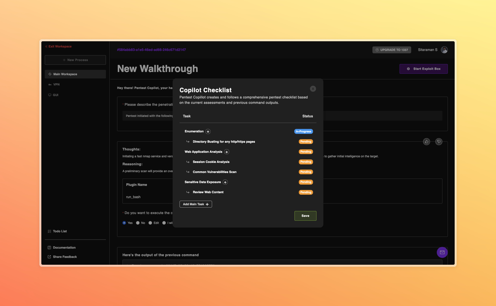

<p align="center">
  
</p>

# Pentest Copilot

[](https://github.com/bugbasesecurity/pentest-copilot/blob/main/LICENSE)
[](https://github.com/bugbasesecurity/pentest-copilot/stargazers)
[](https://github.com/bugbasesecurity/pentest-copilot/forks)

Pentest Copilot is an AI-powered ethical hacking assistant tool designed to streamline your pentesting workflow. Leveraging OpenAI's GPT models, it supports you through critical stages of penetration testing, including reconnaissance, enumeration, vulnerability identification, privilege escalation and data extraction.

Explore the [Github Wiki](https://github.com/bugbasesecurity/pentest-copilot/wiki) for detailed documentation on the tool's features, installation, and usage.

---

<p align="center">

</p>

<p align="center">

</p>

## Pentest Copilot in action 🚀

Here is a quick walkthrough of Pentest Copilot in action trying to PWN a TryHackMe machine [RootMe](https://tryhackme.com/room/rrootme) a boot2root challenge.

https://github.com/user-attachments/assets/5e50b14b-a64f-4ba1-9449-52d5ad61ead6

## Table of Contents

- [Introduction](#introduction)
- [Installation](#installation)
- [Configuration](#configuration)
- [Architecture](#architecture)
- [Features](#features)
- [System Requirements](#system-requirements)
- [Usage](#usage)
- [Contributing](#contributing)
- [License](#license)
- [Disclaimer](#disclaimer)
- [Authors](#authors)
- [Citations](#citations)

<h2 id="introduction">Introduction 🕵️</h2>

Pentest Copilot is an open-source tool built to assist ethical hackers and penetration testers. By integrating LLMs, it automates and enhances various pentesting tasks, making the process more efficient and accessible. The tool is designed to be deployed locally and includes a Kali Linux container for running penetration testing tools directly from the browser.

<h2 id="installation">Installation 🏗️</h2>

To get started with Pentest Copilot, follow these steps:

### Clone the repository:

```bash
git clone https://github.com/bugbasesecurity/pentest-copilot.git pentest-copilot
cd pentest-copilot
```

### Configure environment variables:

1. Copy `./backend/.env.template` to `./backend/.env`.
2. Copy `./frontent/.env.template` to `./frontend/.env`.

```bash
cp backend/.env.template backend/.env
cp frontend/.env.template frontend/.env
```

Read more about the environment variables in the [Configuration](#configuration) section.

### Set up OpenAI API keys:

In `./backend/.env`, add your OpenAI API keys for both the large and small models:

```env
MODEL_API_KEY_LARGE=your_large_model_api_key
MODEL_API_KEY_SMALL=your_small_model_api_key
```

### Set up custom exploit box (Kali server)

In case you want to use a custom host on the integrated browser terminal, you can set the `SSH_*` environment variables in `./backend/.env`:

```env
SSH_HOST=localhost
SSH_PORT=4242
SSH_USERNAME=root

# use either SSH_PASSWORD or SSH_PRIVATE_KEY + SSH_PRIVATE_KEY_PASSPHRASE
SSH_PASSWORD=''
# OR
SSH_PRIVATE_KEY='/path/to/your/private/key'
SSH_PRIVATE_KEY_PASSPHRASE=
```

> [!NOTE]
> If you are using a custom host, ensure that the host is accessible from the backend server.

### Launch the tool using Docker Compose:

```bash
docker compose up --build -d
```

### Access the application:

Once the containers are running, access the frontend at `http://127.0.0.1:3000`.

<h2 id="configuration">Environment Variable Configuration ⚙️</h2>

Pentest Copilot requires configuration through environment variables. Below are the key variables for both the main directory and the backend.

### Main Directory (`.env`)

| Variable                | Description                      | Default                 |
| ----------------------- | -------------------------------- | ----------------------- |
| NEXT_PUBLIC_BACKEND_URI | URL of the backend server        | `http://127.0.0.1:8080` |
| NEXT_PUBLIC_DEPLOYMENT  | Deployment environment           | `LOCAL`                 |
| NEXT_PUBLIC_GTM_ID      | Google Tag Manager ID (optional) |                         |

### Backend (`./backend/.env`)

| Variable                   | Description                            | Default                                    |
| -------------------------- | -------------------------------------- | ------------------------------------------ |
| BASE_URL_FRONTEND          | URL of the frontend server             | `http://127.0.0.1:3000`                    |
| DEPLOYMENT                 | Deployment environment                 | `LOCAL`                                    |
| MONGO_DATABASE             | Name of the MongoDB database           | `pentestcopilot`                           |
| MONGO_URI                  | MongoDB connection string              | `mongodb://127.0.0.1:27017/pentestcopilot` |
| SESS_LIFETIME              | Session lifetime in milliseconds       | `1000`                                     |
| SESS_NAME                  | Session cookie name                    | `sid`                                      |
| SESS_SECRET                | Secret key for signing session cookies | `thisismysessionsecret!123`                |
| PORT                       | Port for the backend server            | `8080`                                     |
| MODEL_LARGE                | Identifier for the large OpenAI model  | `gpt-4-1106-preview`                       |
| MODEL_API_KEY_LARGE        | API key for the large OpenAI model     | `your_large_model_api_key`                 |
| MODEL_SMALL                | Identifier for the small OpenAI model  | `gpt-3.5-turbo-1106`                       |
| MODEL_API_KEY_SMALL        | API key for the small OpenAI model     | `your_small_model_api_key`                 |
| SSH_HOST                   | Hostname for the custom exploit box    | `localhost`                                |
| SSH_PORT                   | Port for the custom exploit box        | `4242`                                     |
| SSH_USERNAME               | Username for the custom exploit box    | `root`                                     |
| SSH_PASSWORD               | Password for the custom exploit box    | `''`                                       |
| SSH_PRIVATE_KEY            | Path to the private key for SSH        | `'/path/to/private/key'`                   |
| SSH_PRIVATE_KEY_PASSPHRASE | Passphrase for the private key         | `''`                                       |

<h2 id="system-components">Architecture 🏗️</h2>

Pentest Copilot follows a microservices architecture using Docker containers:

| Service  | Port(s)              | Description                                                                                                                   |
| -------- | -------------------- | ----------------------------------------------------------------------------------------------------------------------------- |
| MongoDB  | 27017                | Stores application data like user data, sessions and workspace information                                                    |
| Redis    | 6379                 | Handles authentication and workspace data for fast querying                                                                   |
| Backend  | 8080                 | Node.js application that runs the API and socket connections for real-time communication with the frontend and Kali container |
| Frontend | 3000                 | Hosts the user interface built with Next.js                                                                                   |
| Kali     | 4200, 1194/udp, 9020 | Kali Linux container with pre-installed pentesting tools, accessible via SSH, OpenVPN, and noVNC                              |

> [!NOTE]
> You can see the list of tools being installed in the Kali container by checking `./kali/tools.sh`. This file installs all tools, tool names, and the download commands.

<h2 id="system-requirements">System Requirements 💻</h2>

To run Pentest Copilot effectively, your host machine should meet the following minimum requirements:

- **RAM**: 8GB (to accommodate the frontend, backend, databases, and the resource-intensive Kali container)
- **Processor**: Multi-core processor (for smooth operation of multiple containers)
- **Disk Space**: 20GB (for the Kali container and other components)

> [!IMPORTANT]
> The Kali container, which runs a full Kali Linux desktop with pentesting tools, requires significant resources. Allocating at least 2GB RAM to the Kali container is recommended for optimal performance.

<h2 id="features">Features 🚀</h2>

Below is a rundown of what Pentest Copilot brings to the table:

| **Feature**                         | **Description**                                                                                                                    | **Feature**                  | **Description**                                                                                                                      |
| ----------------------------------- | ---------------------------------------------------------------------------------------------------------------------------------- | ---------------------------- | ------------------------------------------------------------------------------------------------------------------------------------ |
| **🤖 AI-Powered Guidance**          | Leverages GPT technology to assist users through all stages of penetration testing.                                                | **⚙️ Workflow Support**      | Facilitates reconnaissance, enumeration, vulnerability identification, privilege escalation, data extraction, and footprint cleanup. |
| **📝 Todo List Management**         | Maintains a per-session todo list, helping you organize prospective attack vectors for structured planning.                        | **🔧 Custom Tool Selection** | Enables users to choose preferred tools by visiting `/settings/tools`, which the copilot uses to generate commands.                  |
| **🏴‍☠️ Exploit Box (Kali Container)** | Offers a Kali Linux container with pre-installed tools (modifiable via `./kali/tools.sh`), accessible via SSH, OpenVPN, and noVNC. | **💻 Integrated Terminal**   | Provides direct terminal access to the Kali container from the workspace page for command execution.                                 |
| **🔒 VPN Integration**              | Allows users to upload custom OpenVPN config files and connect the Kali container to a VPN via the UI.                             | **🏠 Workspace Management**  | Supports creating and managing multiple workspaces, each with isolated sessions.                                                     |

## Frontend Technology

The frontend is built on **Next.js 13** with the app router, utilizing **server-side rendering** and **static site generation** for performance. It integrates with the backend via **REST APIs** and **WebSockets** for real-time functionality.

#### Few Key Technologies:

- **Ant Design**: Reusable UI components for a consistent, responsive interface.
- **Redux Toolkit**: Manages application state for complex interactions.
- **Xterm**: Provides in-browser terminal emulation for Kali container access.
- **Sass**: Enables advanced SCSS styling.
- **React Query**: Handles data fetching, caching, and synchronization with backend APIs.

#### Core Routes:

- **`/login`, `/register`**: User authentication endpoints.
- **`/dashboard`**: Workspace creation and management hub.
- **`/session/[workspace_id]`**: Primary interface for AI interaction and pentesting tasks.
- **`/session/[workspace_id]/gui`**: VNC-based graphical access to the Kali container.
- **`/session/[workspace_id]/vpn`**: UI for uploading and connecting custom OpenVPN configs.

---

## Backend Technology

The backend is powered by **Node.js** and **Express.js**, serving APIs and orchestrating pentesting logic. It integrates with **OpenAI models**, manages databases, and facilitates real-time communication.

#### Few Key Components:

- **Socket.IO**: Enables real-time, bidirectional communication between the frontend and Kali container for live terminal interactions.
- **OpenAI API**: Powers AI-driven command generation and analysis using configurable models (e.g., `gpt-4-1106-preview`, `gpt-3.5-turbo-1106`).
- **MongoDB**: Persistent storage for user data, sessions, and application state (default port: `27017`).
- **Redis**: Fast key-value store for session management and authentication tokens (default port: `6379`).
- **Express.js** - Used to build APIs.

The backend routes all logic through a **central service** (default port: `8080`), connecting user inputs to AI outputs and Kali container execution.

## Local Development

To run Pentest Copilot locally for development, follow these steps:

### Backend

1. Navigate to the `backend` directory:

```bash
cd backend
```

2. Install dependencies:

```bash
npm install
```

3. Start the backend server:

- Start the TS Server in watch mode for compilation in first terminal:

```bash
npm run watch
```

Once the inital compilation is done, start the server in the second terminal:

- Start the server in the second terminal:

```bash
npm run dev
```

Now, on subsequent changes, the server will automatically restart.

The backend server will start at `http://localhost:8080`.

### Frontend

1. Navigate to the `frontend` directory:

```bash
cd frontend
```

2. Install dependencies:

```bash
npm install
```

3. Start the frontend server:

```bash
npm run dev
```

The frontend server will start at `http://localhost:3000`.

## Meet the Authors

- Dhruva Goyal - [dhruva@bugbase.ai](mailto:dhruva@bugbase.ai) | [LinkedIn](https://www.linkedin.com/in/dhruva-goyal/) | [Github](https://github.com/shero4) | [Twitter](https://twitter.com/dhruvagoyal)
- Aditya Peela - [aditya@bugbase.ai](mailto:aditya@bugbase.ai) | [LinkedIn](https://www.linkedin.com/in/aditya-peela/) | [Github](https://github.com/adityamhn)
- Sitaraman Subramanian - [sitaraman@bugbase.ai](mailto:sitaraman@bugbase.ai) | [LinkedIn](https://www.linkedin.com/in/sitaraman-s/) | [Github](https://github.com/hackerbone)

## Citations

If you use Pentest Copilot in your research, please cite:

```bibtex
@article{goyal2024hacking,
  title={Hacking, the lazy way: LLM augmented pentesting},
  author={Goyal, Dhruva and Subramanian, Sitaraman and Peela, Aditya},
  journal={arXiv preprint arXiv:2409.09493},
  year={2024}
}
```

## Contributing

We welcome contributions to Pentest Copilot! Please review our [Contributing Guide](./CONTRIBUTING.md) to get started. Also, ensure you adhere to our [Code of Conduct](./CODE_OF_CONDUCT.md).

## License

This project is licensed under the [MIT License](./LICENSE).

## Disclaimer

Pentest Copilot is intended solely for ethical hacking and penetration testing. Always ensure you have explicit permission to test any systems you target.
